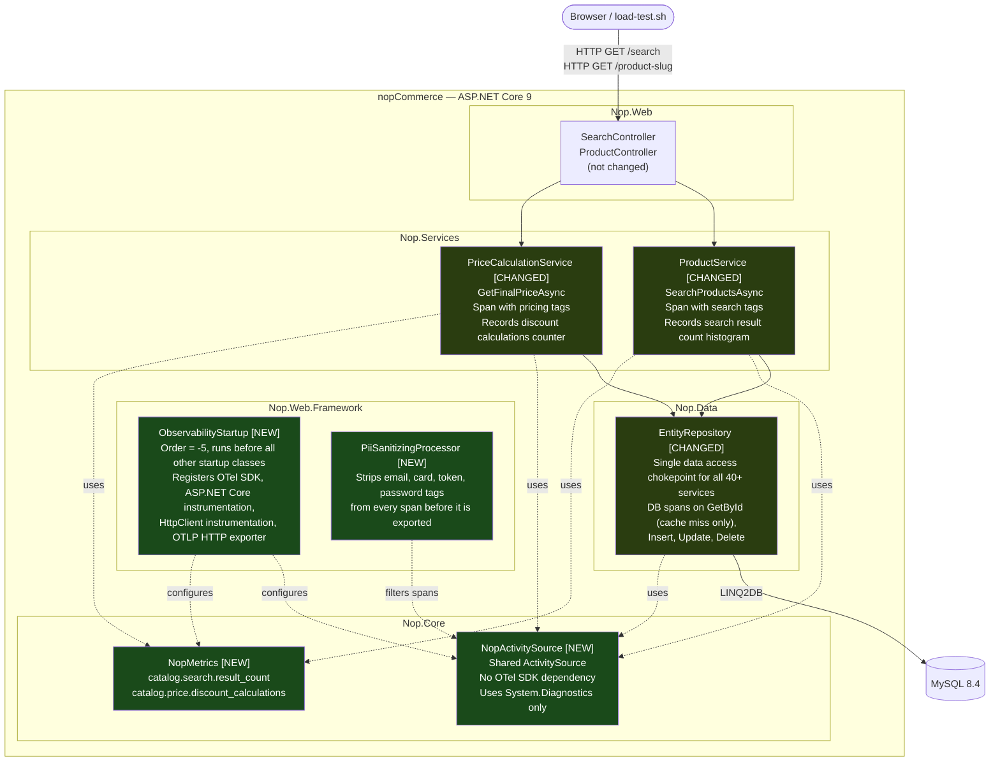
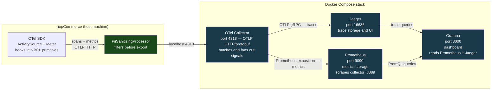

# OpenTelemetry Instrumentation — Assignment 1

Instrumented fork of nopCommerce 5.00 for Assignment 1 — Observability in the Wild.
The instrumented flow is **Customer searches and views a product** (Catalogue, Search, Pricing).

---

## Architecture

### Request Flow

Files marked **[NEW]** were created as part of this assignment. Files marked **[CHANGED]** had instrumentation added to existing code.



### Telemetry Pipeline

How signals travel from the application to Grafana.



---

## Quick Start

Everything runs with one command from the `AS-nopCommerce/` directory:

```bash
make all
```

This starts the Docker observability stack, builds the .NET solution, waits for MySQL, and starts the app.

**URLs once running:**

| Service     | URL                     | Credentials   |
|-------------|-------------------------|---------------|
| nopCommerce | http://localhost:5000   |               |
| Grafana     | http://localhost:3000   | admin / admin |
| Jaeger      | http://localhost:16686  |               |
| Prometheus  | http://localhost:9090   |               |

---

## Individual Commands

```bash
make up             # start Docker stack only
make build          # restore and build .NET solution
make run            # start the app (waits for MySQL)
make loadtest       # run 20-worker load test for 120s
make logs           # tail all container logs
make collector-logs # tail OTel Collector logs only
make down           # stop containers, keep data
make clean          # stop containers and delete volumes
```

---

## Load Test

```bash
make loadtest
```

Or directly with custom parameters:

```bash
./load-test.sh [BASE_URL] [DURATION_SECONDS] [CONCURRENCY]

# Examples
./load-test.sh                              # defaults: localhost:5000, 120s, 20 workers
./load-test.sh http://localhost:5000 60 5   # lighter run
```

The script simulates keyword searchers, category browsers, and product page viewers.
Roughly 30% of product views hit the five products with a discount applied, so the Grafana
discount rate panel shows a non-zero value under load.

---

## Custom Metrics

**`catalog.search.result_count`** (Histogram, tagged `has_keyword` / `has_category`)

A sustained drop toward zero in this distribution without any HTTP errors is an early signal
that the search index or ACL configuration is broken. The endpoint returns 200 with an empty
result set, so error rate alone would not catch this.

**`catalog.price.discount_calculations`** (Counter, tagged `discount_applied`)

During an active promotional campaign, the `discount_applied=true` rate should track with
product page views. If it drops to zero while a sale is live, the discount configuration is
broken. This failure is silent from an HTTP perspective — pages load normally, just without
the expected discount.

---

## Grafana Dashboard

The dashboard is auto-provisioned at startup. Open http://localhost:3000, log in, and the
nopCommerce dashboard is under Dashboards.

The JSON export lives at `observability/grafana/provisioning/dashboards/nopcommerce.json`.

---

## Documentation

| File | Contents |
|---|---|
| `ARCHITECTURE_ANALYSIS.md` | Architectural reading of nopCommerce before instrumentation |
| `INSTRUMENTATION_CHANGES.md` | Every file changed, with rationale |
| `CRITIQUE.md` | Architectural assessment — what helped, what did not, what to change |

---

---

# nopCommerce: free and open-source eCommerce solution
===========

[nopCommerce](https://www.nopcommerce.com/?utm_source=github&utm_medium=content&utm_campaign=homepage) is the best open-source eCommerce platform. nopCommerce is free, and it is the most popular ASP.NET Core shopping cart.


### Key features ###

* The product is being developed and supported by the professional team since 2008.
* nopCommerce has been downloaded more than 3,000,000 times.
* The active developer community has more than 250,000 members.
* nopCommerce runs on .NET 9 with an MS SQL 2012 (or higher) backend database.
* nopCommerce is cross-platform, and you can run it on Windows, Linux, or Mac.
* nopCommerce supports Docker out of the box, so you can easily run nopCommerce on a Linux machine.
* nopCommerce supports PostgreSQL and MySQL databases.
* nopCommerce fully supports web farms. You can read more about it [here](https://docs.nopcommerce.com/en/developer/tutorials/web-farms.html?utm_source=github&utm_medium=referral&utm_campaign=documentation&utm_content=text).  
* All methods in nopCommerce are async.
* nopCommerce supports multi-factor authentication out of the box.
* Start our [online course for developers](https://nopcommerce.com/training?utm_source=github&utm_medium=referral&utm_campaign=course&utm_content=text) and get the practical and technical skills you need to run and customize nopCommerce websites.


nopCommerce architecture follows well-known software patterns and the best security practices. The source code is fully customizable. Pluggable and clear architecture makes it easy to develop custom functionality and follow any business requirements.

Using the latest Microsoft technologies, nopCommerce provides high performance, stability, and security. nopCommerce is also fully compatible with Azure and web farms.

Our clear and detailed [documentation](https://docs.nopcommerce.com/developer/index.html?utm_source=github&utm_medium=referral&utm_campaign=documentation&utm_content=text) and [online course](https://nopcommerce.com/training?utm_source=github&utm_medium=referral&utm_campaign=course&utm_content=text) for developers will help you start with nopCommerce easily.


### The advantages of working with nopCommerce ###

nopCommerce offers powerful [out-of-the-box features](https://www.nopcommerce.com/features?utm_source=github&utm_medium=referral&utm_campaign=features&utm_content=text) for creating an online store of any size and type.

nopCommerce is integrated with all the popular third-party services. You can find thousands of integrations on nopCommerce [Marketplace](https://www.nopcommerce.com/marketplace?utm_source=github&utm_medium=referral&utm_campaign=marketplace&utm_content=text).

The [Web API plugin](https://www.nopcommerce.com/web-api?utm_source=github&utm_medium=referral&utm_campaign=WebAPI&utm_content=text) by the nopCommerce team lets you build integrations with third-party services or mobile applications using REST. The Web API plugin is available with source code and covers all methods of nopCommerce: backend and frontend. You can read more about it [here](https://www.nopcommerce.com/web-api?utm_source=github&utm_medium=referral&utm_campaign=WebAPI&utm_content=text).

Friendly members of the [nopCommerce community](https://www.nopcommerce.com/boards?utm_source=github&utm_medium=referral&utm_campaign=forum&utm_content=text) will always help with advice and share their experiences. nopCommerce core development team provides [professional support](https://www.nopcommerce.com/nopcommerce-premium-support-services?utm_source=github&utm_medium=referral&utm_campaign=premium_support&utm_content=text) within 24 hours.


## Store demo ##

Evaluate the functionality and convenience of nopCommerce as a customer and store owner.

Front End | Admin area
----|------
[](https://demo.nopcommerce.com?utm_source=github&utm_medium=referral&utm_campaign=demo_store&utm_content=button) | [](https://admin-demo.nopcommerce.com/admin?utm_source=github&utm_medium=referral&utm_campaign=demo_store&utm_content=button)


### nopCommerce resources ###

nopCommerce official site: [https://www.nopcommerce.com](https://www.nopcommerce.com/?utm_source=github&utm_medium=referral&utm_campaign=homepage&utm_content=links)

* [Demo store](https://www.nopcommerce.com/demo?utm_source=github&utm_medium=referral&utm_campaign=demo_store&utm_content=links)
* [Download nopCommerce](https://www.nopcommerce.com/download-nopcommerce?utm_source=github&utm_medium=referral&utm_campaign=download_nop&utm_content=links)
* [Online course for developers](https://nopcommerce.com/training?utm_source=github&utm_medium=referral&utm_campaign=course&utm_content=links)
* [Feature list](https://www.nopcommerce.com/features?utm_source=github&utm_medium=referral&utm_campaign=features&utm_content=links)
* [Web API plugin](https://www.nopcommerce.com/web-api?utm_source=github&utm_medium=referral&utm_campaign=WebAPI&utm_content=links)
* [nopCommerce documentation](https://docs.nopcommerce.com?utm_source=github&utm_medium=referral&utm_campaign=documentation&utm_content=links)
* [Community forums](https://www.nopcommerce.com/boards?utm_source=github&utm_medium=referral&utm_campaign=forum&utm_content=links)
* [Premium support services](https://www.nopcommerce.com/nopcommerce-premium-support-services?utm_source=github&utm_medium=referral&utm_campaign=premium_support&utm_content=links)
* [Certified developer program](https://www.nopcommerce.com/certified-developer-program?utm_source=github&utm_medium=referral&utm_campaign=certified_developer&utm_content=links)
* [nopCommerce partners](https://www.nopcommerce.com/partners?utm_source=github&utm_medium=referral&utm_campaign=solution_partners&utm_content=links)

nopCommerce YouTube: [The Architecture behind the nopCommerce eCommerce Platform](https://www.youtube.com/watch?v=6gLbizzSA9o&list=PLnL_aDfmRHwtJmzeA7SxrpH3-XDY2ue0a)


### Earn with nopCommerce ###

60,000 stores worldwide are powered by nopCommerce, and 10,000 new stores open every year. nopCommerce [solution partners’ directory](https://www.nopcommerce.com/partners?utm_source=github&utm_medium=referral&utm_campaign=solution_partners&utm_content=text_become_partner) gets 80,000+ page views per year from store owners who are looking for a partner to build a store from scratch, migrate from another platform, or improve and customize an existing store.

Become a solution partner of nopCommerce and get new clients – [learn more](https://www.nopcommerce.com/become-partner?utm_source=github&utm_medium=referral&utm_campaign=become-partner&utm_content=learn_more).

Create a new graphical theme or develop a new plugin or integration and sell it on the nopCommerce [Marketplace](https://www.nopcommerce.com/marketplace?utm_source=github&utm_medium=referral&utm_campaign=marketplace&utm_content=text_sell_on_marketplace).


### Contribute ###

As a free and open-source project, we are very grateful to everyone who helps us to develop nopCommerce. Please find more details about the options and bonuses for contributors at [contribute page](https://www.nopcommerce.com/contribute?utm_source=github&utm_medium=referral&utm_campaign=contribute&utm_content=text).
